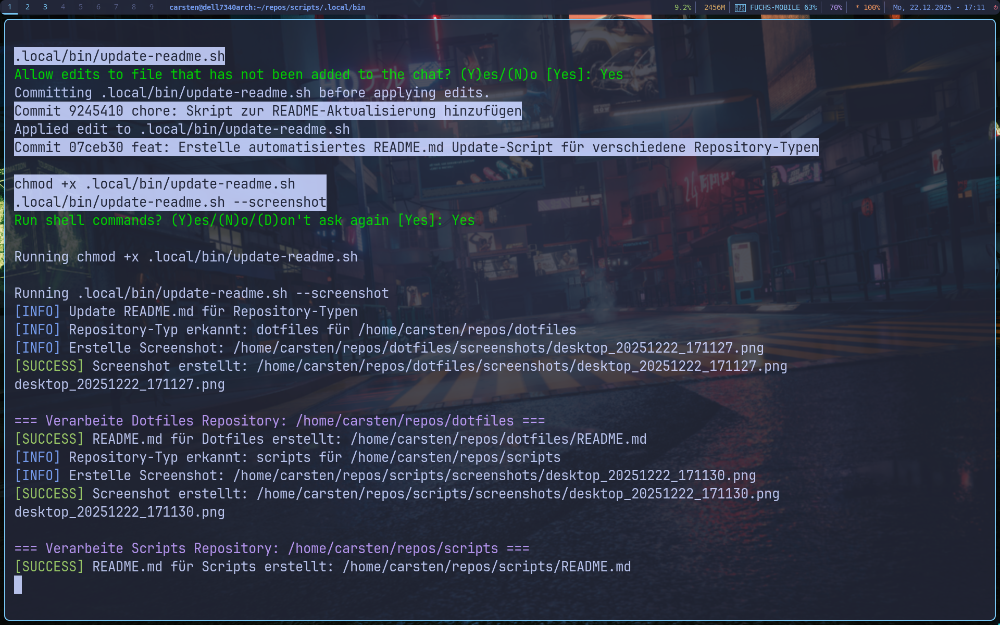

# 🐧 Arch Linux Install Script

<div align="center">


**[🇬🇧 English](#-english) | [🇩🇪 Deutsch](#-deutsch)**



</div>

---

## 🇬🇧 English

Interactive installation script for a minimal Arch Linux setup with Qtile.

### ✨ Features

- **Interactive Configuration** – All settings are prompted
- **Hardware Detection** – CPU and GPU auto-detected
- **Multi-GPU Support** – Intel, AMD, NVIDIA, Hybrid (Optimus)
- **Btrfs + Snapper** – Automatic snapshots with GRUB integration
- **Qtile Desktop** – Minimal tiling window manager
- **Dotfiles Integration** – Optional: Auto-setup dotfiles and scripts

### 🚀 Quick Start

```bash
# Boot Arch ISO, connect to network, then:
curl -LO https://raw.githubusercontent.com/Sampirer/arch-install/main/arch-install.sh
chmod +x arch-install.sh
./arch-install.sh
```

### 💻 Supported Hardware

| Component | Options |
|-----------|---------|
| **CPU** | Intel, AMD (auto microcode) |
| **GPU** | Intel, AMD, NVIDIA, Intel+NVIDIA (Optimus), AMD+Intel |
| **Disk** | NVMe, SATA, VirtIO |

### 📁 Partition Scheme

```
┌─────────────────────────────────────────────────┐
│ Disk                                            │
├──────────┬──────────┬───────────────────────────┤
│ EFI 1GB  │ Swap     │ Root (Btrfs)              │
│ FAT32    │ ~RAM+2GB │ Subvolumes: @, @home, ... │
└──────────┴──────────┴───────────────────────────┘
```

### 📦 Installed Packages

**Base:** `base linux linux-firmware grub btrfs-progs networkmanager`

**Desktop:** `qtile alacritty picom dunst rofi feh thunar pipewire`

**Optional:** `starship fzf zoxide yay blesh` (with dotfiles)

### 📚 After Installation

The script can automatically set up dotfiles:
- Clones `dotfiles` and `scripts` repositories
- Applies all Stow configurations
- Installs AUR packages (yay, blesh)

### 🔗 Related

- [dotfiles](https://github.com/Sampirer/dotfiles) – Configuration files
- [scripts](https://github.com/Sampirer/scripts) – Utility scripts

---

## 🇩🇪 Deutsch

Interaktives Installationsscript für ein minimales Arch Linux Setup mit Qtile.

### ✨ Features

- **Interaktive Konfiguration** – Alle Einstellungen werden abgefragt
- **Hardware-Erkennung** – CPU und GPU werden automatisch erkannt
- **Multi-GPU-Support** – Intel, AMD, NVIDIA, Hybrid (Optimus)
- **Btrfs + Snapper** – Automatische Snapshots mit GRUB-Integration
- **Qtile Desktop** – Minimaler Tiling Window Manager
- **Dotfiles-Integration** – Optional: Dotfiles automatisch einrichten

### 🚀 Schnellstart

```bash
# Arch ISO booten, Netzwerk verbinden, dann:
curl -LO https://raw.githubusercontent.com/Sampirer/arch-install/main/arch-install.sh
chmod +x arch-install.sh
./arch-install.sh
```

### 💻 Unterstützte Hardware

| Komponente | Optionen |
|------------|----------|
| **CPU** | Intel, AMD (automatischer Microcode) |
| **GPU** | Intel, AMD, NVIDIA, Intel+NVIDIA (Optimus), AMD+Intel |
| **Disk** | NVMe, SATA, VirtIO |

### 📁 Partitionsschema

```
┌─────────────────────────────────────────────────┐
│ Disk                                            │
├──────────┬──────────┬───────────────────────────┤
│ EFI 1GB  │ Swap     │ Root (Btrfs)              │
│ FAT32    │ ~RAM+2GB │ Subvolumes: @, @home, ... │
└──────────┴──────────┴───────────────────────────┘
```

### 📦 Installierte Pakete

**Basis:** `base linux linux-firmware grub btrfs-progs networkmanager`

**Desktop:** `qtile alacritty picom dunst rofi feh thunar pipewire`

**Optional:** `starship fzf zoxide yay blesh` (mit Dotfiles)

### 📚 Nach der Installation

Das Script kann automatisch die Dotfiles einrichten:
- Klont `dotfiles` und `scripts` Repositories
- Wendet alle Stow-Konfigurationen an
- Installiert AUR-Pakete (yay, blesh)

### 🔗 Verwandt

- [dotfiles](https://github.com/Sampirer/dotfiles) – Konfigurationsdateien
- [scripts](https://github.com/Sampirer/scripts) – Utility Scripts

---

<div align="center">

## 📋 Changelog

| Version | Changes |
|---------|---------|
| **2.2** | Dotfiles auto-setup, AUR support (yay, blesh) |
| **2.1** | NVIDIA modules after driver install |
| **2.0** | Interactive config, hardware detection, multi-GPU |
| **1.0** | Initial version |

---

**Made with ❤️ for Arch Linux**

</div>
